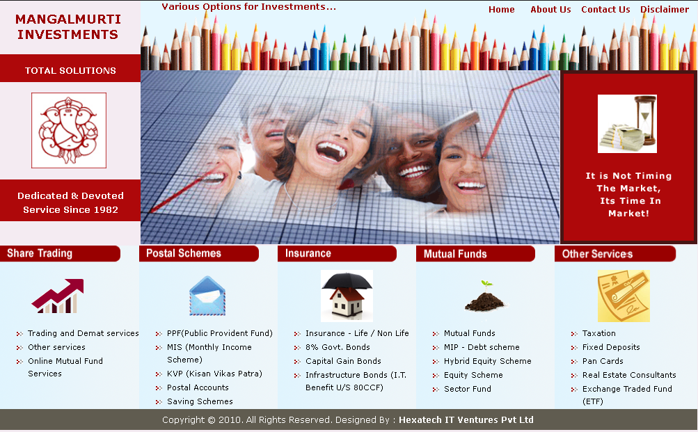

# Mangalmurti-Investments-Website

<a href="mangalmurtiinvestments.com/bootstrap/GitHub/index.html"> Live Demo</a>

<b>Introduction</b>:
The aim of this project is to redesign, renovate and bring the old website Mangalmurti Investments up to speed with the modern style of UI and technologies and render easy maintainability of the same.

Aug 2017 - November 2015 (1 Hours/Day)
  

<b>Vision</b>:
<ul>
<li>Easily maintianable website</li>
<li>Successfully represent the brand and image of Mangalmurti Investments</li>
<li>Responsive Website Design</li>
</ul>

<b>Unique Selling Point</b>
<ul>
<li>Risk Tolerance Quizzes, which provided the user with a choice to setup a appointment after they completed it.</li>
<li>Data from these Quizzes exported to a Google Sheet, and Mangalmurti Investments is notified about requested Appointments by Email.</li>
<li>Ability to send Emails using Static FTP Host, using Google Script</li>
</ul>

<b>Result</b>
<ul>
<li>Extremely Satisfied Client.</li>
<li>Responsive Website Design.</li>
<li>Google Analytics were added to derive stronger insights from traffic.</li>
<li>Google Scripts were used to make it possible to send emails from static HTML Pages.</li>
</ul>

<b>Screenshots</b>
<b>Old Website</b>

 

<b>New Updated Website</b>

 
<b>Libraries:</b>
<ul>
<li>BootStrap</li>
<li>Landed <i>a BootStrap theme by HTML5 UP</i></li>
<li>Cushy CMS <i> to make site editing easier</li>
</ul>

  
<b>Tools:</b>
<ul>
<li>Visual Studio Code</li>
</ul>

<b>Conclusion</b>
The client, Mr. Dekhane was pleasantly surprised with the new look and feel of the website. Gathering of Customer details was now possible. The website appropriately represented what Mangalmurti Investments stood for.

<b>tl;dr</b> <a href="mangalmurtiinvestments.com/bootstrap/GitHub/index.html"> Live Demo</a>